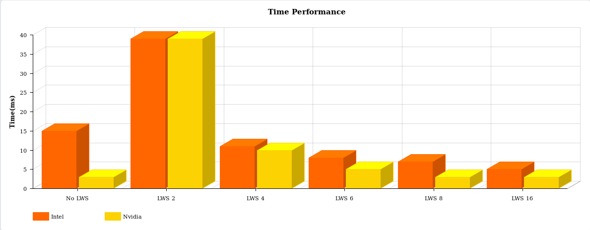
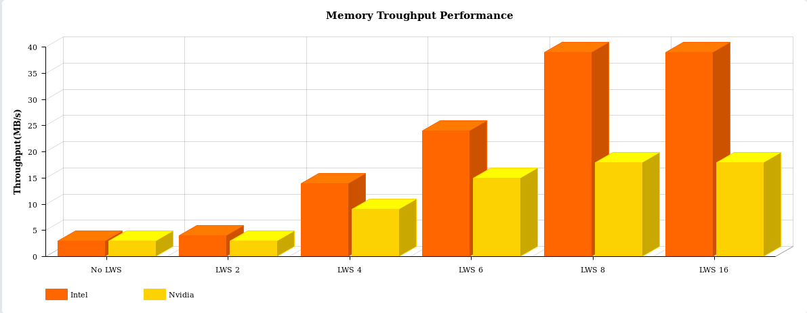

# Game of Life (written in OpenCL)

## Summary

- [General](#general)
- [Usage](#usage)
- [Implementation](#implementation)
- [Generation Kernel](#GenerationKernel)
- [Performance](#performance)
- [Notes](#notes)

## General

The _**Game of Life**_, also known simply as _**Life**_, is a cellular automaton devised by the British mathematician _**John Horton Conway**_ in 1970.
The game is a **_zero-player game_**, meaning that its evolution is determined by its initial state, requiring no further input. One interacts with the Game of Life by creating an initial configuration and observing how it evolves, or, for advanced players, by creating patterns with particular properties.

### Rules

The universe of the Game of Life is an infinite, two-dimensional orthogonal grid of square cells, each of which is in one of two possible states, _alive_ or _dead_. Every cell interacts with its eight neighbours, which are the cells that are horizontally, vertically, or diagonally adjacent. At each step in time, the following transitions occur:

1.  Any live cell with fewer than two live neighbors dies, as if by underpopulation.
2.  Any live cell with two or three live neighbors lives on to the next generation.
3.  Any live cell with more than three live neighbors dies, as if by overpopulation.
4.  Any dead cell with exactly three live neighbors becomes a live cell, as if by reproduction.

The initial pattern constitutes the _seed_ of the system. The first generation is created by applying the above rules simultaneously to every cell in the seed; births and deaths occur simultaneously, and the discrete moment at which this happens is sometimes called a _tick_. Each generation is a pure function of the preceding one. The rules continue to be applied repeatedly to create further generations.

### Used Seeds

Many different types of patterns occur in the _Game of Life_, which are classified according to their behaviour. In this implementation were used the following patterns:

##### Gosper Glider Gun

the Gosper _glider gun_ produces its first glider on the 15th generation, and another glider every 30th generation from then on.

##### DieHard

_Diehard_ is a pattern that eventually disappears, rather than stabilizing, after 130 generations, which is conjectured to be maximal for patterns with seven or fewer cells.

##### Acorn

_Acorn_ takes 5206 generations to generate 633 cells, including 13 escaped gliders.

## Usage

Compile project:

    cd gameoflife_opencl
    make

Run game of life with specific options:

    ./main seed rows cols generations lws [i] [p]

Seed option specific which configuration use:

- g - Gosper
- a - Acorn
- d - DieHard

lws option must be considerated as lws^2^, i option move around a bug found using Intel Graphics Gen6 graphic card and p option disable grid visualitation.

## Implementation

This implementation of the Game of life is written using ANSI C for the host(CPU) code and OpenCL for the device(GPU) code. Four kernels have been implemented:

- **_init_** kernel for initialization of grid with specified seed.
- **_where_expand_** kernel calculates on which sides the grid will have to expand.
- **_expand_** kernel creates a new grid where sides indicated by where_expand are expanded.
- **_generation_** kernel is the core of the project and execute rules for forward the generation.

## Generation Kernel

This is the core of the algorithm, as it computes the generation change.

The automaton works locally for each cell, analyzing it and its 8 neighbors and deciding for each step of the loop to which state it should to hire.

There are 2 different versions of the automaton, each one being more suited for different hardware:

- A **_global memory_** implementation, without any particular optimizations (target: newer GPUs with hardware caching, devices without a local memory like CPUs)
- A **_local memory_** caching implementation, theoretically more optimized (target: older GPUs without hardware caching)

## Performance

The performance tests were performed on two completely different graphics cards: the **Nvidia GT940M** and the **Intel Graphic Card 520**. From the tests emerges as on the Nvidia card we have better results using the hardware cache or use a very large lws while on the intel card the best performances are only with a large lws.

##### Time(ms)

| LWS    | Nvidia | Intel |
| ------ | ------ | ----- |
| No LWS | 3ms    | 15ms  |
| 2      | 39ms   | 39ms  |
| 4      | 10ms   | 11ms  |
| 6      | 5ms    | 8ms   |
| 8      | 3ms    | 7ms   |
| 16     | 3ms    | 5ms   |

##### Memory Throughput(GB/s)

| LWS    | Nvidia | Intel  |
| ------ | ------ | ------ |
| No LWS | 3GB/s  | 3GB/s  |
| 2      | 3GB/s  | 4GB/s  |
| 4      | 9GB/s  | 14GB/s |
| 6      | 15GB/s | 24GB/s |
| 8      | 18GB/s | 39GB/s |
| 16     | 18GB/s | 39GB/s |

## Notes

A bug was found with the _clEnqueueBufferRect()_ method using the Intel video card. The bug corrupts the mishandling of allocation resources and goes into segmentation fault. To avoid this bug, instead of using the _clEnqueueBufferRect()_ method, a method has been developed that loads the host array to the GPU. The i option enable this method.
